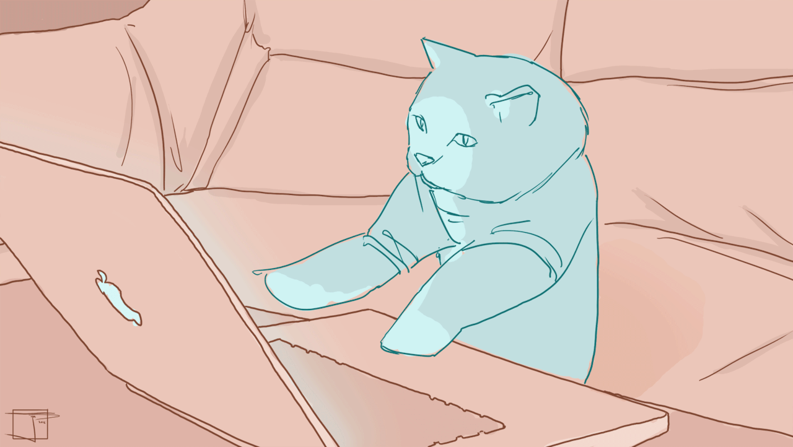

<!-- statistic badges -->
 

<!-- followers & stars
&nbsp;&nbsp;  &nbsp;&nbsp;   
-->

<!-- welcome banner -->
<!--  -->

<!--main-->
## 👧🏻  I'm a fresh software engineer...

...who on a journey to explore the tech world, constantly learning to turn lines of code into groundbreaking solutions! 🚀

- 🎓 Bachelor of Software Engineering (2024).

- 🌱 I’m currently learning **front-end development**.

- 💬 Ask me about **C# (.NET), Database, Git**.

- 🏅 My [Licenses & Certifications](https://www.linkedin.com/in/lamvo0602/details/certifications/).

- 🪪 My [Linkedln Profile](https://www.linkedin.com/in/lamvo0602/?locale=vi_VN).

- 📫 How to reach me **[v.trclam@gmail.com](mailto:v.trclam@gmail.com)**
 

## Languages and Tools

    
    
    
    
        
        
    
    
    
    
            
              
    
    
    
    

<!--my stats-->
<!-- 

 -->
<!-- 

 -->

